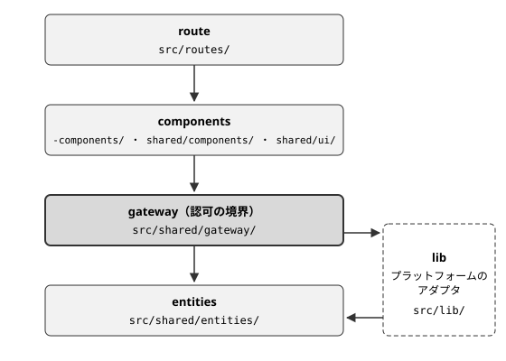

<div class="doc-header">
  <div class="doc-title">個人用フロントエンドテンプレート開発の歴史</div>
  <div class="doc-author">いまいまい</div>
</div>

# 個人用フロントエンドテンプレート開発の歴史

imaimai-front-templete は、私が作り直し続けているフロントエンド用のテンプレートリポジトリです。個人開発を始めるたびに環境構築をするのが面倒なので、新しいプロジェクトをこのリポジトリから始められるように手を入れ続けています。GitHub の説明文は「いまいまいのフロント用テンプレートです」の一文だけですが、いまの中身は、AI エージェントの Claude Code と Cursor が開発を担う前提で作り込んであります。

```url
https://github.com/imaimai17468/imaimai-front-templete
```

## エージェントに開発を任せる

私が楽しいと感じるのは、新しい技術を使って何かを作り、その結果を眺めているときです。技術そのものを突き詰めることより、使ってみて何ができあがるかを見るほうに興味があります。エージェントに開発を任せたいのも、作ったものを眺めるほうに時間を使いたいからです。自分の技術力を磨くことも大事だと思っていますが、このテンプレートは、エージェントが自律的に開発できる作りにしてきました。

エージェントに任せるにあたって、私はまず静的検査を強くしました。エージェントの出力は実行するたびに変わるので、型と lint とテストで機械的に検出できる範囲を広げ、検出できない部分を小さくするところから始めたいと考えたからです。

作業の進め方も、私が指示を出し続けなくても回るように決めてあります。依頼を受けたエージェントは、コードを書く前に依頼をチケットへ割ります。チケットは「単独でマージしても`main`の CI が緑のままになる最小の変更」です。

### AGENTS.md の行動指針

規約の本体は`AGENTS.md`です。読むのはエージェントなので、エージェント向けの文書は英語で書いています。`AGENTS.md`の多くは、エージェントが実際に起こした失敗を受けて足した行動指針です。`AGENTS.md`は毎ターン読み込まれるので、理由の言い直しを削り、5,182 語から 3,613 語に減らしました。そのため指針の理由の多くは、その指針を入れたときの commit や PR に残っています。

#### 断定

主張を断定の形で書いてよいかは、同じ応答の中でそれを確かめたかで決めさせます。

困っていたのは、確かめていない断定でした。実行すれば 1 回で分かる誤りが、断定の形でコメントに残っていた例が 2 つありました。どちらもレビューが commit の前にみつけましたが、書いたエージェント自身は気づいていませんでした。チケットごとにエージェント（worker）を立てる並列開発では、worker が、渡された前提のうち 4 つが誤りだとみつけたことがあります。そのうち 1 つは、すでに PR の本文に主張として載っていました。

そこで、他のファイル、commit、ツール、件数、自分が書いたコードの挙動は、開くか実行したものだけを断定させ、確かめていないものは断定しない書き方にさせています。

バージョン、フラグ、設定、import パス、ライブラリの使い方も、同じ軸で扱います。エージェントが学習したデータは、このリポジトリが使うバージョンより古いことがあるので、記憶にあることは確かめた内容として扱わせません。公式ドキュメント、仕様、ライブラリのソースのどれか 1 つで確かめさせ、4 回ほど調べて分からなければ止めて、確認できなかったことを文に書かせます。Effect は、パッケージに同梱された`node_modules/effect/AGENTS.md`を最後まで読ませます。他の解説の多くは、このリポジトリが使う v4 より前のものだからです。

#### 検査

検査が通ったと言ってよいかは、その検査を実際に実行したかで決めさせます。

困っていたのは、検査が通知なしに飛ばされることでした。検査の仕組みは mise や Node が入っている前提で作っています。依存が欠けた環境で検査が飛ばされると、マシンごとに保証される内容が違うのに、それを示すものがなくなります。

そこで、必要なコマンドがない環境でも手順を簡略化して進めることは認めつつ、実行しなかった手順は「passed」ではなく「not run」として報告させています。セッションの開始時に依存の欠けを報告するフックも、同じ理由で置いています。

型エラーの直し方は、直したあとも型検査がその箇所の誤りを検出できるかで決めさせます。`as`や`any`で消すと、私がエージェントに任せる前提として強くしている静的検査が、その箇所で働かなくなるからです。そこで`src/`の下では、`as`と`any`、`@ts-ignore`、非 null アサーションの`!`を禁じています。lint を無効にするコメントも禁じています。型の絞り込みやスキーマの検証で直させ、どうしても直せないときは、PR を Draft のまま残して解けない型を名指しで報告させます。

#### 判断の分担

判断をエージェントが決めるか私に返すかは、そのコストを測れるのが誰かで決めさせます。

困っていたのは、エージェントが自分で決められる判断まで私に預け、報告の最後を文章の質問で終えていたことでした。

そこで、注意深いエンジニアなら選ぶデフォルト値はエージェントが決めることにしました。私に返すのは、私にしかコストを測れない判断（好み、使っている環境、リスクの許容度）と、本番環境やお金に関わることだけです。返すときは確認のダイアログで 1 つずつ聞かせ、いちばん多くの作業を止めている判断から聞かせます。

私が指示した手段も、そのまま実行するとは限りません。私の指示は、そのとき私が手元に持っていた情報から選んだ手段で、目的にとって最適とは限らないからです。一方で、エージェントも私の事情や確認していない意向を知りません。そこで、代案を返すかどうかは、効果、コスト、安全性、実現性のどれかで選択が変わるかで決めさせ、変わるときだけ代案とトレードオフを示してから動かします。並列に動く worker は、自分が勧める手段で進め、選ばなかった案を PR の本文に残します。

承認を待つ範囲も、同じ軸で引き直しました。以前は、`wrangler.toml`、マイグレーション、認証を変える PR は、マージの前に私の承認を待っていました。いまは開発用のインフラはエージェントが変えてよいことにし、私を待つのはデプロイ、シークレットの登録、リモートのデータベースへのマイグレーションだけです。本番環境とお金に関わる判断は、私にしかコストを測れないからです。

#### 知識の置き場所

エージェントが得た知識をどこに書くかは、次のエージェントがその知識に出会うかと、書いた内容が正しいまま保たれるかで決めさせます。

Claude Code の自動メモリは、この軸で使わないことにしました。メモリはレビューと版管理を通らず、それを思い出したエージェントにしか効きません。そこで、エージェントが学んだことは自動メモリに保存させず、次のエージェントが作業の中で目にする場所（規則ファイルやスキル）に書かせています。この指針を入れたときに、メモリにあった 6 件を消し、要るものだけを規則ファイルやスキルに移しました。

コードのコメントも、同じ軸で書く内容を絞っています。issue や PR の番号、別のファイルの挙動を指すコメントは、指す先が変わっても誰も直さないので、いずれ事実と合わなくなります。そこで、コメントにはすぐ下のコードの説明だけを書かせます。誤った使い方を防ぎたいときは、コメントの代わりに名前、型、構造を変えさせ、誤った使い方がコンパイルできない形にさせます。

ルールそのものの書き方も決めています。ある振る舞いをやめさせたいとき、禁止だけを書いたルールでは、禁じた行動以外のやり方はどれも許されたままで、読み手のエージェントが代わりの行動を自分で考えることになります。そこで、ルールには代わりにとる行動を書かせ、代わりの行動がないときだけ、禁止をそのままルールにします。

## 現在の構成

アプリは TanStack Start で作り、Cloudflare Workers で動かしています。データベースは Cloudflare D1（SQLite）、画像の置き場は Cloudflare R2、認証は Better Auth の Google OAuth です。

### 層の分け方

ディレクトリは、URL を表す`src/routes/`、複数のルートが使うものを置く`src/shared/`、プラットフォーム用のアダプタを置く`src/lib/`の 3 つに分けています。



ファイルの層は、パスの中でいちばん内側にある役割ディレクトリで決まります。役割ディレクトリは`components/`、`gateway/`、`entities/`で、`src/routes/`の中ではルートとして扱われないよう、`-components/`のように先頭に`-`を付けます。route は components と gateway を読み、components は gateway と entities を読み、gateway は entities を読みます。entities と gateway から上の層を import すると、lint がエラーになります。

gateway は認可の境界です。データベースに触れる処理は gateway に集め、route と component からは直接触らないようにしました。この向きは、自作の oxlint プラグイン`tools/oxlint-plugins/arch-rules.js`でも検査しています。route からデータベースに触れると、「Delegate to a gateway.」というメッセージで lint がエラーになります。

### アプリのスタック

アプリ側の主な依存を、執筆時点の`package.json`から抜き出しました。

| 用途 | パッケージ | バージョン |
| :-- | :-- | :-- |
| UI | react | 19.2.3 |
| ルーティング | @tanstack/react-router | 1.170.32 |
| フレームワーク | @tanstack/react-start | 1.168.49 |
| データ取得 | @tanstack/react-query | 5.102.8 |
| 非同期処理とスキーマ | effect | 4.0.0 |
| 認証 | better-auth | 1.7.2 |
| O/Rマッパ | drizzle-orm | 0.45.2 |
| スタイル | tailwindcss | 4.3.2 |
| フォーム | react-hook-form | 7.85.0 |
| バリデーション | zod | 4.4.3 |

UI 部品には shadcn/ui（Radix UI）を使い、`src/shared/ui/`に置いています。zod は devDependencies にあり、アプリの entities のスキーマには Effect Schema を使っています。

### 開発基盤

開発に使うパッケージも、同じく`package.json`の値です。

| 用途 | パッケージ | バージョン |
| :-- | :-- | :-- |
| パッケージマネージャー | bun | 1.3.1 |
| ビルド・lint・format の CLI | vite-plus | 1.0.0 |
| lint | oxlint | 1.85.0 |
| format | oxfmt | 0.70.0 |
| 型検査 | typescript | 7.0.2 |
| テスト | vitest | 5.0.1 |
| Git hooks | lefthook | 2.1.10 |
| 未使用コードと重複の検出 | fallow | 3.27.0 |
| Cloudflare の CLI | wrangler | 4.110.0 |
| dev サーバの URL 割り当て | portless | 0.15.6 |

テストは、`.ts`のファイルごとに分岐カバレッジ 100％ を満たさないと失敗します（`vitest.config.mts`の`perFile: true, branches: 100`）。`.tsx`のコンポーネントは、この条件の対象外です。CI は最後に`bun run smoke`を実行します。ビルドした Worker を workerd（Cloudflare Workers のランタイム）で起動し、主なルートに HTTP リクエストを送る検査です。ビルドは通るのに、どのリクエストでも例外を投げる Worker は、この検査でしか検出できません。

### 特徴的なパッケージ

表のうち、このテンプレートに特徴的なパッケージは次のとおりです。

- `vite-plus`（Vite+）：Vite、Vitest、oxlint、oxfmt を 1 つの CLI にまとめる。`vp check`が format、lint、型検査を 1 回のファイル走査で実行し、設定は`vite.config.ts`の`lint`と`fmt`に集まる
- `typescript`（7 系）：Go で書き直された TypeScript のコンパイラ。型を見る lint（oxlint-tsgolint）も、この実装で型を解決する
- `fallow`：使われていない export やファイル（dead-code）と、コードの重複（dupes）を検出する。識別子の名前だけを変えたコピーも重複として扱う
- `portless`：dev サーバに`http://my-app.localhost:1355`のような名前付きの URL を割り当て、ポートを空きから選ぶ。worktree ではブランチ名がサブドメインに付く
- `ultracite`：oxlint の設定プリセット集。core、React、TanStack、Vitest に加えて、根拠のない型アサーションやモジュールのモックを拒む anti-slop を有効にしている
- `react-doctor`：React のコードを検査する CLI。oxlint のプラグインとしてルールを足し、CI でも`bun run doctor`を実行する
- `@shadcn/lint`：shadcn/ui のデザインシステムを検査する。呼び出し側が`className`で部品の見た目を上書きするとエラーになり、配置用のクラスだけを通す
- `oxlint-plugin-effect`：Effect 向けの lint ルール。`async`と`await`の禁止もこのルールで行う

## エージェント向けの仕組み

エージェントに規約を守らせる仕組みは、`.claude/`の下の hooks、guidance、skills、agents に分けて置いています。

### hooks

`.claude/hooks/`のスクリプトは、Claude Code のフック機能から呼ばれます。主なものは次のとおりです。

- **Stop gate**（`stop-gate.sh`）：エージェントが応答を終えようとしたときに動く。その応答の中でコードが変わっていれば`bun run check`と`bun run test`を実行し、失敗したら終了を止めて直させる。
- **Bash guard**（`pre-bash-guard.sh`）：Bash の実行前に、`.env`系のファイルに触れるコマンドや、パスを指定しない`git add`などを拒否する。
- **返信の先頭行の検査**（`reply-open-gate.sh`）：返信の最初の行が、コマンド、パス、コード片のどれかで始まっていなければ、書き直させる。
- **scoped-guidance**（`scoped-guidance.sh`）：エージェントが触れたファイルのパスや実行したコマンドに応じて、読むべき規則ファイルを案内する。

dead-code のようにリポジトリ全体で結果が決まる検査は、Stop gate に入れず、CI と pre-push で実行しています。1 回の応答の差分だけでは、全体の結果を判定できないからです。

### guidance

規則ファイルは`.claude/hooks/guidance/`に置き、扱う範囲ごとに分けています。

- `data-fetching.md`：データ取得
- `design.md`：デザイン
- `functions.md`：関数の形
- `prose.md`：文章
- `react.md`：React
- `replies.md`：返信

以前は規則を`.claude/rules/`に置いていました。規則は必要な場面で読めばよいので、起動時に全部を読ませるのをやめたいと考えました。

そこで、各ファイルの frontmatter に`paths`（対象のファイル）や`commands`（`git commit`など）を書いておく形にしました。エージェントがそのファイルを読み書きしたり、そのコマンドを実行したりすると、scoped-guidance が「このファイルを最後まで読んでから続けて」と 1 行で指示します。フックから規則の本文を直接コンテキストに入れる方法も試しましたが、長い本文が 2KB のプレビューに切り詰められたので（43.1KB の本文で起きました）、読むよう指示するだけにしています。

その結果、エージェントが規則ファイルを読むのは、そのファイルの対象に当てはまる操作をしたときだけになりました。案内はセッションごとに 1 回で、コンテキストを圧縮したあとは改めて案内します。代わりに、Cursor のセッションにはどの規則も案内されなくなったので、Cursor では作業に必要な規則をエージェント自身が開きます。

### skills と code-reviewer

`.claude/skills/`には、名前のついた作業の手順を置いています。中心は ticket-work で、1 つのチケットを、依頼内容の確認から PR のマージまで 7 つのステップで進めます。ticket-work の最後のステップでは、コミットの前に code-reviewer のエージェントを呼びます。

code-reviewer（`.claude/agents/code-reviewer.md`）は、コードを書いたのとは別のコンテキストで、未コミットの差分をレビューするエージェントです。1 つのコンテキストの中で、次の 4 つの段階を順に踏みます。

1. find の段階では、差分を一度読み、観点ごとに指摘の候補を挙げる。観点は、ロジック、状態、データの整合性、セキュリティ、不要なコードや重複、既存コードの再利用、効率、根本原因を直しているか、リポジトリの規則。この段階では候補を絞らない。
2. dedup の段階では、同じ欠陥を指す候補をまとめる。1 つの変更で両方が直る候補だけを 1 つにする。
3. refute の段階では、候補ごとに実際のコードを開き直し、反証を試みる。判定は次の 4 つ。
    - CONFIRMED（コードで追えた）
    - PLAUSIBLE（もっともらしいが追い切れていない）
    - REFUTED（成り立たない）
    - ABSTAINED（判定に必要なファイルや情報を確認できない）
4. return の段階で、残った指摘を返す。

候補をみつける段階では、不確かなものも含めてすべてを挙げさせます。ここで候補を絞ると、反証の段階を生き残ったはずの指摘まで失うからです。ただし観点によって拾う強さを変えていて、ロジック、状態、データの整合性、規則の 4 つは漏れなく拾わせます。不要なコード、再利用、効率、根本原因の 4 つは、振る舞いが変わらない差分（名前の変更など）には、ほとんど指摘させません。フォーマットや import の順番のように`bun run check`が報告するものも、指摘させません。

セキュリティの観点は、「境界の両側が、それぞれ自分に届いたものを検証する」という考え方で具体的に書いています。たとえば、`createServerFn`のバリデーターが、ハンドラーの使うフィールドを素通しにしていないかを見させます。gateway が、どのユーザーの行を触るかをセッションではなく引数から決めていないかも見させます。データベースの行や URL のパラメータが、`href`や`redirect()`に検証なしで届いていないかも見させます。ブラウザ側のチェックだけでは何も守れません。サーバー関数は直接呼べるからです。そのため、この観点の指摘は重大度を critical か major にします。

反証の段階では、候補を挙げたのと同じエージェントが反証するので、独立性は自分で用意させます。候補ごとにコードを開き直させ、反証したものも含めて、すべての判定に、開き直した`ファイル:行`を付けさせています。コードを開かずに下した判定が、出力から見えるようにするためです。

判定を保留する ABSTAINED は、反証済みの候補と混ぜないための区分です。保留してよい理由は 3 つに限っています。外部の CLI やライブラリの挙動で決まる場合、判定に必要なファイルがリポジトリにない場合、この環境では実行して確かめられない場合です。どれにも当てはまらなければ、REFUTED にさせます。code-reviewer には Web を検索する機能を与えていないので、外部の挙動で決まる候補は、リポジトリに根拠がなければ ABSTAINED になります。

返す指摘には、直す場所と内容を具体的に書いた修正案（fix）と、直ったことを確かめるコマンドか観察点（acceptance）を必ず付けさせます。呼び出し側のエージェントはこの結果をそのまま適用してコミットするので、修正案の妥当性をあとで判断する工程がないからです。「サーバー側でサイズを検証する」のような修正案は認めず、どのファイルに何を書くかまで書かせます。トレードオフについて私の判断が要るときは、選択肢を挙げさせ、エージェントには決めさせません。

報告には、挙げた候補の数、まとめた数、反証した数、保留した数、返した数を書かせます。「挙げた数 − まとめた数」が残りの 3 つの合計になるので、全部が反証された場合でも、反証の段階が実際に動いたことを確かめられます。観点ごとにどこまで差分を見たかも書かせ、指摘が出なかった観点について、問題がなかったのか、見ていないのかを区別させています。

## 捨ててきたもの

私は定期的に、テンプレートを新しいスタックで作り直したくなります。一度はファイルをすべて削除して作り直し、Next.js のプロジェクトも一度作り直しています。

### lint と format

最初は ESLint、Prettier、husky、lint-staged を入れていました。その後 Biome と lefthook に移り、husky を削除しています。

次に、lint と format をもっと速くしたいと考えました。Rust で JavaScript の parser、linter、formatter を作っている oxc プロジェクトの速さを使いたかったからです。そこで Biome をやめて、oxc の oxlint と oxfmt に移りました。同時に型検査も tsgo（Go で書かれた TypeScript の型検査器）に替え、型検査にかかる時間は 2.88 秒から 0.49 秒になり、約 5.8 倍速くなりました。

その後、Vite、Vitest、oxlint、oxfmt を個別に持っているのをやめたいと考えました。4 つとも、Vite+ が同梱するものとほぼ同じバージョンを使っていたからです。そこで 4 つを Vite+ の 1 つの CLI にまとめました。設定は`vite.config.ts`の`lint`と`fmt`のブロックに移し、`oxlint.config.ts`と`.oxfmtrc.json`を消しています。移す途中で、`vp lint`が`oxlint.config.ts`を読まないことが分かりました。つまり移す前の状態では、`vp lint`から自作の層ルールや 20 件の override が効いていませんでした。いまは、Vite+ が同梱するバージョンと`package.json`の宣言のずれを、`scripts/check-toolchain-pins.ts`で pre-push と CI が照合しています。

未使用コードの検出は knip で行っていましたが、fallow に移しました。検出する対象が knip とほぼ重なり、`fallow migrate`で knip.json をそのまま変換でき、npm の devDependency として入るからです。knip にあって fallow にないのは TypeScript の namespace メンバーの検出だけで、このリポジトリには namespace の宣言がありません。fallow はコードの重複も検出できるので、重複の検査も CI と pre-push に足しました。移した直後には、`package.json`に宣言しないまま import していた yaml と zod を fallow がみつけています。

### Next.js と Supabase

認証とデータベースには、最初 Supabase と Drizzle（drizzle-orm）を使っていました。データベースだけでなく、ドメインやデプロイもまとめて管理したいと考えて、Supabase をやめ、Cloudflare D1/R2 と Better Auth（Google OAuth）に移りました。その結果、データベース、ストレージ、デプロイが Cloudflare にまとまりました。ただ、ユーザー管理だけは大変だった記憶があります。

フレームワークは、Next.js から TanStack Start に移りました。それまでは OpenNext というアダプタを通して、Next.js を Cloudflare Workers で動かしていました。アダプタを挟むと、Next.js のマイナーリリースごとに、OpenNext の追従を待たなければなりません。16.x では実際に追従が遅れました。Server Components、Server Actions、Route Handlers など、サーバー側の実行モデルが重なっていることも気になっていました。テストはすでに Vite ベースの Vitest で動いていたので、ビルドも Vite にそろえたいと考えました。そこで OpenNext と Next.js を外し、TanStack Start へ一度に置き換えました。その結果、開発とビルドが Vite だけで動くようになり、サーバー側の処理はサーバー関数と API ルートの 2 つの書き方にまとまりました。

### Effect への統一

TypeScript のルールをより厳密にして、書き方のばらつきをなくしたいと考えていました。そこで Effect v4 を入れ、まず画像（avatar）を読み取る経路を Effect で書き直しました。手書きの依存注入を Effect のサービスと Layer に置き換え、「未認可」「キーが不正」「見つからない」の 3 つの失敗を型付きのエラーにしています。その結果、ルートで失敗に対応するレスポンスを書き忘れると、コンパイルがとおらなくなりました。

このとき入れたのは、正式版より前の 4.0.0-rc.112 です。`bunfig.toml`の`minimumReleaseAge`で、公開から 7 日経っていないバージョンを入れないようにしているので、より新しい RC は選べませんでした。

続いて、`async`と`await`を禁じる lint ルール（`effect/noAsyncFunction`）を error に上げ、`src/`で報告された 212 件を解消しました。中身のない`async () => await f()`は`() => f()`に書き換え、逐次処理をもつ箇所だけを Effect に移しています。entities のスキーマも zod から Effect Schema に移しました。2 つを並べて置くと、このリポジトリで禁じている互換レイヤになるからです。

正式版の 4.0.0 が公開されると、すぐに上げました。公開から 7 日経っていませんでしたが、このときだけ制限を外して入れています。アプリのコードは変えずに、型検査、テスト、smoke テストがとおりました。

データ取得も TanStack Query に移しました。それまで使っていたルーターのキャッシュはルート間で共有されず、ルートの loader とプロフィール画面が同じユーザーを別々に取得していました。そのうえ誰もキャッシュを無効化しないので、プロフィールを保存しても、ヘッダーの名前はページを再読み込みするまで古いままでした。そこで、リクエストごとに QueryClient を作り、ルートの loader で取得したデータをコンポーネントが`useSuspenseQuery`で読む形にしました。保存は`useMutation`で行い、成功したらキャッシュを無効化します。その結果、ヘッダーの名前も再読み込みなしで変わるようになりました。

## エージェント向けの仕組みの削除

エージェント向けに足した仕組みも、何度も削除してきました。大規模なワークフローは、エージェントの動きを決まった手順に固めます。固めた手順は他の仕組みと絡み合うので、あとから剥がすのが難しくなります。そしてモデルが進化すると、以前のモデルに合わせて固めた手順が、新しいモデルの動きを縛る足枷になります。そこでいまは、1 つ 1 つの仕組みが互いに依存しないようにして、要らなくなったらその部分だけを削除できる形にしています。

### MCP サーバーと知識ベース

MCP サーバーは、context7、Serena、Kiri、Chrome DevTools、Next DevTools、Codex を足していました。Kiri は、リポジトリのコードを DuckDB に索引し、タスクに関係するコードを順位づけして返す MCP サーバーです。

使っていくうちに、要らないものが分かってきました。Serena は、エージェント向けのメモリが要らなかったので削除しました。理由は、Claude Code の自動メモリを使わせないのと同じです。メモリはレビューと版管理を通らず、それを思い出したエージェントにしか効きません。Kiri も、その索引がレビューと版管理を通らない知識の置き場所だったので、同じ理由で削除しました。Next DevTools は、Chrome DevTools で足りていたので外しました。Codex は、MCP サーバーを通さなくても CLI（`codex exec`）で呼べるので外しています。残した Chrome DevTools と context7 は、MCP サーバーの設定から Claude Code のプラグインに移し、使っていなかった Figma のプラグインも削除しました。

Aegis という MCP サーバーも入れていました。規則と ADR（設計判断の記録）を知識ベースに取り込み、エージェントが作業の前に知識ベースへ問い合わせたかを、フックで確認する仕組みです。ところが、問い合わせを強制する仕組みが MCP サーバーの起動に依存していて、サーバーが起動しないと、作業手順を守らせる仕組みごと動かなくなりました。そこで Aegis とそれに関わるフック 5 本を削除し、リポジトリの中のファイルだけで動くフック 7 本を残しました。

あわせて、31 本あった ADR も削除しました。ADR にしか書かれていなかった運用上の事実は 4 つで、それぞれ、その事実が必要になる場所（`docs/DEPLOYMENT.md`や`AGENTS.md`など）へ書き直しています。過去の経緯は Git の履歴に残っています。

### スタンプでレビューを強制していた時期

レビューを済ませないと commit できないようにしたくて、スタンプの仕組みを作ったことがあります。code-reviewer が完了するとフックがスタンプ（印のファイル）を書き、スタンプがないと Bash のガードが`git commit`を拒否します。ファイルを編集するとスタンプが消えるので、修正したらもう一度レビューが必要です。

ところが、この仕組みには穴がみつかり続けました。スタンプはレビューの完了ではなく、レビュー用のエージェントを起動した時点で書かれていて、所見を何も出さなくても commit が通っていました。リモートのコンテナでは、MCP サーバーの再接続のたびにスタンプが消え、最後まで終えたレビューが無駄になっていました。穴を塞ぐたびに決まりとフックが増え、候補を探すエージェントと反証するエージェントの間で編集していないことを証明するために、マーカーとフックまで必要になりました。

そこで、スタンプの仕組み（フック 5 本、それを支えるライブラリ 2 本、テスト 2 本、Cursor 側のコピー）をまとめて削除しました。2 つに分けていたレビューのエージェントも 1 つにまとめ、すべての判定に開き直した`ファイル:行`を付ける決まりで、反証したことが出力から見えるようにしています。レビューは作業手順の 1 つとしてだけ残し、レビューを省いてよいとエージェントが判断したときは、自分では進めず、私へ判断を返させます。

その結果、エージェントはスタンプを待たないで commit できるようになり、そのあと worktree による並列開発も始めました。`main`を守るのは、CI の`build`を必須のチェックにした GitHub のルールセットです。撤去前の 7 週間ほどにマージした PR（Dependabot のものを除く）は 30 本で、撤去後の同じくらいの期間は 242 本でした。並列開発も同じ時期に始めているので、すべてが撤去の効果だとはいえません。レビューそのものは続いていて、撤去後の 242 本のうち 88 本は本文で code-reviewer のレビューに触れています。スタンプの仕組みを戻した commit はありません。

スタンプを使っていたころに足した他の仕組みも削除しました。レビューにコードの依存関係のグラフを入れていましたが、ベンチマークで、ファイルが 51 個の規模ではトークンの削減効果がありませんでした。並列に動かした候補探しのエージェントも同じバグを重複してみつけていたので、グラフと並列の探索をやめています。修正後の再レビューを安くする delta モードは、再レビューそのものをやめたので、安くする対象がなくなりました。エージェントが思い出して選ぶ必要のあるモードで、実際には選ばれていませんでした。レビュアーの検出率を測る eval は、手順を変えるたびに実行する決まりでしたが、実際には守られていなかったので削除しました。

### フック

作業のたびに動くフックは、待ち時間や作業の中断が大きいものを削除しました。ファイルへの書き込み前に動くフックは 3 本あり、書き込みのたびに作業を止めるので、使い勝手が悪くなっていました。そこで 3 本とも削除しています。応答が終わるたびに Opus のサブエージェントと Chrome DevTools を起動して画面を確かめるフックも、毎回の起動にかかる時間とコストが大きかったので削除しました。

ファイルを編集するたびに lint を実行するフックも削除しました。同じ linter が pre-commit、pre-push、Stop gate、CI の 4 か所ですでに動いていて、このフックで変わるのは、エラーに気づくタイミングだけでした。そのうえ、複数のファイルにまたがるリファクタリングの途中では、壊れていて当然の状態で作業が止まっていました。

## おわりに

中身はこれからも入れ替えていくつもりです。テンプレートは公開しているので、エージェントに開発を任せる構成の例として、必要な部分だけ取り入れてください。
