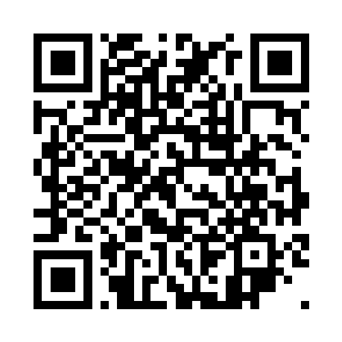
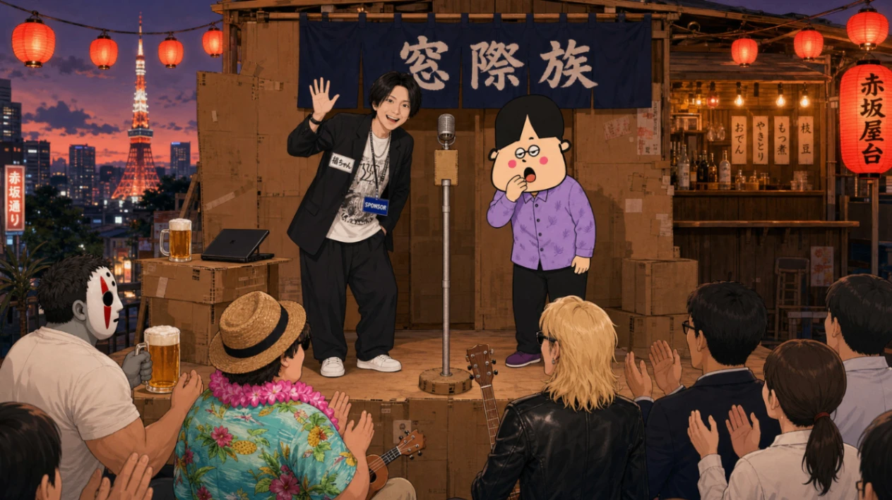
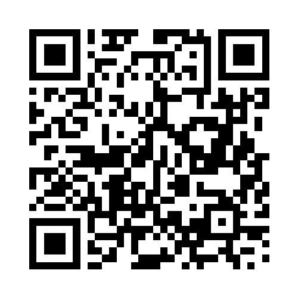
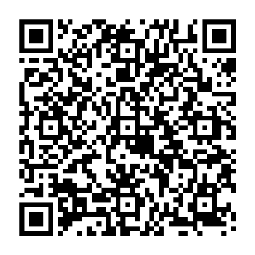
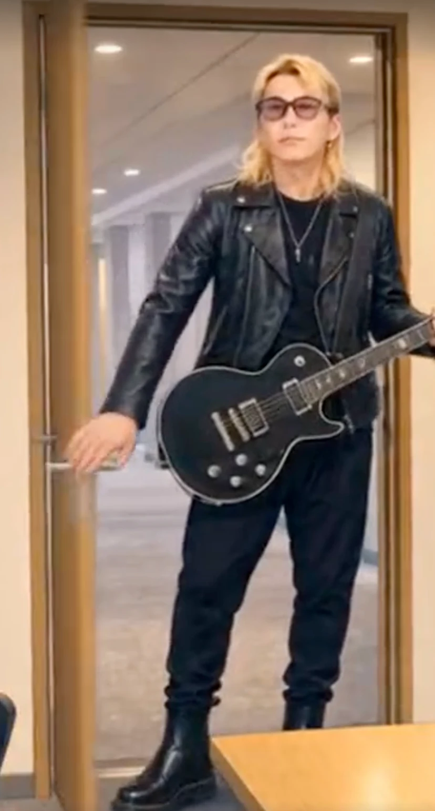
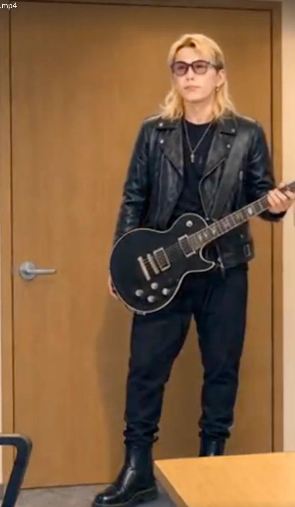

  
窓際の生きる技術（動画作成の道標）

  
そば屋

# 窓際の生きる技術（動画作成の道標）

## はじめに

窓際族物語を楽しんでくれていますか。窓際族物語は、白い仮面の怪人「そば屋」をはじめとする 8 体のキャラクターが繰り広げるコンテンツ IP です。生成 AI で制作した動画やイラストなど、さまざまなネタを X に投稿しているので、「窓際族物語」で検索してみてください 著者の X アカウント, https://x.com/sobaya15。

{width=110}

動画や画像の精度を上げる方法は意外と知られていないみたいです。そこで本章では、窓際代表として、窓際の生きる方法をまとめます。

なお、本章で紹介する設定ファイルやスクリプトは、すべて GitHub リポジトリ Seedance_Madogiwa, https://github.com/sobaya-0141/Seedance_Madogiwa で公開しています。世界観・キャラクター設定・台本といった IP の原典ドキュメントから、動画制作のワークフロー、ゲームなどの制作物までを 1 つのリポジトリで一元管理しています。

{width=110}

また、作成した動画やゲームなどは、すべて公式サイト 窓際族物語の公式サイト, https://madogiwa.work/ に置いてあるので、ぜひご覧ください。動画については素材やプロンプトも参照できるようになっているので、参考にしてみてください。

{width=110}

著者は、Seedance 2.0→Seedance 2.5→MiniMax H3（以下、H3）という流れで、使う動画生成 AI を変えてきました。ただ、どれを使っても精度の上げ方に大きな違いはないと感じています。

## 画像生成の精度を上げる

画像生成は、精度を上げつつ数をこなす必要があります。そのため、簡単な指示でイラストを作成できるようにしておくことが重要です。動画を作るときにもサンプルとして画像を渡すと精度の向上につながるため、画像の生成は一発ネタだけでなく動画生成時にも重要になります。

リポジトリの`02_CHARACTERS`ディレクトリ キャラクター設定, https://github.com/sobaya-0141/Seedance_Madogiwa/tree/main/02_CHARACTERS にあるように、キャラクターの名前やサイズ感、絶対に崩してはいけない設定（NG 変更）と画像をまとめておきます。

{width=110}

キャラ設定をまとめておくと、「そば屋がビールを飲んでるシーンを描いて」とか「福ちゃんとやめ太郎が漫才をしているシーンを描いて」と指示するだけで、次のような画像を用意してくれます。

さらに精度を上げるためのポイントは、次の 2 つです。

- 実写を使わない（すべてイラスト化する）
- サンプル画像は正面だけでなく、側面や背面も用意する

実際に、実写を使っている福ちゃんの精度は安定しないのに対して、イラスト化しているそば屋や無職やめ太郎の精度は高くなっています。

また、動画に使用する画像を用意するときのために、キャラ設定だけでなく世界観の設定もしっかり用意しておくと、背景の精度が上がってよいです。

<!-- 追記（リポジトリの対応より）: 参照画像の役割をプロンプトで明記するルール -->

もうひとつ、参照画像を渡すときのコツがあります。プロンプト側で「Image 1 はそば屋のリファレンスで、仮面とジョッキは変えない」のように、画像の役割と NG 変更の要素を明記することです。参照画像を黙って渡すだけの場合とくらべて、キャラ崩れがさらに減ります。

<!-- 追記（リポジトリの対応より）: PR #31, #33 キャラクターシートの正典化・参照同梱の機械チェック -->

### キャラクターシートを正典にする

キャラ設定の画像は、1 枚の「キャラクターシート」へまとめると参照の精度がさらに上がります。窓際族物語では、正面・側面・背面のターンアラウンドに、仮面やジョッキといった NG 変更要素のクローズアップ、表情差分、身長チャートまで収めたシートを全キャラ分用意しました。このシートをキャラ参照画像の第一参照としています。複数キャラが登場するシーンでは、全キャラを正しい相対身長で横に並べた身長比較の画像もスケールの参照として渡します。

あわせて、キャラごとに年齢・身長・体格・服装を含む英語 1 行の「同定句」を決めておき、プロンプトでキャラに言及するときは「名前＋同定句＋参照画像の番号」の形へ統一しています。表記ゆれによるキャラの取り違えを防げます。また、参照画像は動画制作のランごとのディレクトリへ物理的にコピーして同梱し、同梱漏れやプロンプト側の宣言漏れは検証スクリプトで機械的にチェックしています。

## 音声の精度を上げる

窓際族物語では、次の 3 パターンで音声を用意しています。

- 動画を作るとき、動画生成 AI に音声も入れてもらう
- VOICEVOX VOICEVOX, https://voicevox.hiroshiba.jp/ で音声を作って動画生成 AI に渡す
- Irodori-TTS Irodori-TTS, https://github.com/Aratako/Irodori-TTS で音声を作って動画生成 AI に渡す

{width=110}

{width=110}

VOICEVOX はクレジット表示が必要で、キャラごとの利用規約もあります。それに対して Irodori-TTS は狙った声を作れます。この 2 点から、Irodori-TTS をメインで使うようにしていこうとしています。なお、サンプルを渡さずに動画生成 AI へ任せると、動画ごとに声が変わったり、日本語の発音も微妙だったりします。そこで後述するように、Seedance のときは用意した音声を声のサンプルとして渡して発声させ、H3 のときは音声をそのまま使っています。

### Irodori-TTS の精度の上げ方と活用

窓際族物語では、福ちゃんと無職やめ太郎の 2 人は本人の声に寄せています。おかやまんとそば屋は、初期に作った窓際族物語の動画から音声を抜き出したものを元にして、そば屋はさらにモンスターっぽい声に加工しています。

福ちゃんと無職やめ太郎は、YouTube で公開されているイベントの動画から、次の条件にマッチするものをサンプル音声として Irodori-TTS に渡します。

- 本人だけが話しているシーン
- BGM などがなく静かなシーン
- 長さは 5〜10 秒

そして、Seed 値が違う 4 パターンの音声を出してもらい、最適なものを選んで確定させています。

おかやまんについては福ちゃんたちと同じ方法です。そば屋はそのままの声だと面白くないので、モンスターのような声に加工しました。具体的には、ピッチを 5 半音下げて、70Hz のトレモロでうなりを加えています。ピッチを下げても音声の尺は変わらないため、後述するリップシンクの用途にもそのまま使えます。加工の詳細は Pull Request そば屋の声を長尺の参照音声とモンスターボイス加工に変更, https://github.com/sobaya-0141/Seedance_Madogiwa/pull/26 を参照してください。

{width=110}

音声の検証をするときには、一言だけでなく、少し長めな文章を読ませたほうが安定した品質のものを作れるようになります。実際に福ちゃんの音声を検証したとき、「ギュンギュン」とだけいわせた段階ではよさそうでした。しかし、会話をさせるとボロボロになったり、突然女性の声へ変わったりしました。サンプル音声の変更と Seed 値の変更で、地道に理想へ近づけます。

<!-- 追記（リポジトリの対応より）: PR #23 参照音声の長尺化・選定条件 -->

### 参照音声を差し替えて分かったこと

その後、クローンの精度が低い原因を調査して、参照音声を差し替える改善も行いました。原因は 2 つありました。参照音声が短すぎたこと（福ちゃんは 2.4 秒、やめ太郎は 3.8 秒しかありませんでした）と、「ギュンギュンで〜す」のような一発ギャグ調の発声で、声質の情報が偏っていたことです。公式のパラメータガイドや実践報告でも、参照音声は 5〜10 秒・通常トーン・単独話者・ノイズなしが推奨されています。1〜2 分の長尺は、むしろ不利になります。また、フォーマットは 44.1kHz・モノラル・16bit の wav に統一しています。

<!-- 追記（リポジトリの対応より）: VOICE_CAST.md の正典化・既定シード運用・ナレーション声 -->

### 配役表とシード値の運用

キャラごとの使用エンジン・話者・参照音声・シード値は、`02_CHARACTERS/VOICE_CAST.md`という配役表にまとめて、これを唯一の正としています。媒体を問わず、キャラの声はこの表で指定したエンジンと設定を使い、勝手に別の声へ変えません。

Irodori-TTS の生成には揺らぎがありますが、同じシード値と同じテキストであれば毎回同じ音声が出ます。そこで、本人らしさを確認できたテイクのシード値を「デフォルトシード」として配役表に記録しておきます。まずデフォルトシードで生成して、抑揚や間が合わないセリフだけ別のシードを試すという運用です。

また、窓際メンバー以外の発話用に、ナレーション声も Irodori-TTS のボイスクローンで追加しました。ナレーションやモブの発話が必要になっても、動画ごとに声がブレなくなります。

<!-- 追記（リポジトリの対応より）: PR #28 クレジット表記の必須化・本人同意 -->

### クレジット表記と本人の同意

VOICEVOX の利用規約では、使用キャラクターのクレジット表記が求められています。窓際族物語では表記漏れを防ぐため、VOICEVOX の声を 1 つでも使った動画には、動画内（画面内）にクレジットを表示することをルール化しました。クレジットの文字を動画生成 AI に描かせると崩れるため、CapCut のテキスト機能でエンドカードやオーバーレイとして載せます。音源キャラクターごとに商用利用の可否などの規約も異なるため、新しい話者を使うときは公式サイトで確認します。

そして、ボイスクローンの参照音声は、実在のメンバー本人の声です。必ず本人の同意の範囲内でのみ使用し、公開範囲が変わる場合は改めて本人へ確認します。

## 動画の精度を上げる

ここまでで画像の精度と音声の精度が上がっているので、あとは動画作成だけです。

「画像生成の精度を上げる」でも書きましたが、世界観の設定は動画のプロンプトを用意するときにもとても役に立ちます。用意しないとシーンごとや動画ごとにブレが大きくて面白くならないので、必ず用意してください。

動画用のプロンプトは、数秒ごとに区切ってとても細かく内容を指示します。ここで紹介すると大変なので、リポジトリの台本ファイル 台本ファイルの例, https://github.com/sobaya-0141/Seedance_Madogiwa/blob/main/03_SCRIPTS/18_ichiban_kuji_all_cast_cm/script.md を参照してください。

{width=110}

もちろん、このプロンプトは手書きではなく Codex に任せています。Codex にはざっくりした指示だけを伝えて、プロンプト・画像・音声を作ってもらいます。

動画作成時に重要だったのは、次の 2 点です。

- クリップごとに開始フレームと終了フレームを画像で渡し、必ずその画像を使うように指示する
- 別で作った音声ファイルを声のサンプルとして渡し、そのサンプルどおりの声で音声も付与してもらうよう指示する

開始と終了以外の画像を入れると、逆に精度が落ちたりブレたりしがちなので、なるべく入れません。開始フレームと終了フレームの両方を渡して間を補間させることで、キャラのブレやちらつき、構図のズレを減らせます。

<!-- 追記（リポジトリの対応より）: キーフレームのチェーン生成とつなぎ目の共有 -->

この開始・終了フレーム（キーフレーム）同士が食い違うと、動画生成 AI の補間がモーフィングのように崩壊します。そこで、キーフレームはゼロから独立に生成せず、必ず前の絵を種にして次の絵を作ります。

1. クリップ 1 の開始フレームを、登場キャラ全員の参照画像を渡して生成する
1. クリップ 1 の終了フレームは、開始フレームを入力に加えて「同じ絵のまま、状態だけ終了状態に変える」形で生成する
1. クリップ 2 の開始フレームには、クリップ 1 の終了フレームと同一の画像ファイルを使い回す

前のクリップの終了フレームと次のクリップの開始フレームを同一画像にすることで、クリップのつなぎ目が消えます。共有できるところは再生成せずにファイルを使い回して、生成の揺らぎを持ち込まないようにします。

なお、著者とは別に動画作成をしている窓際仲間のタコさん（@K9i_apps）は、フレーム画像を一切渡さずに作成すると精度が上がると言っていました。プロンプトなどの条件によって、最適な渡し方は変わるようです。

<!-- 追記: 音声をそのまま使う方式からサンプル参照で Seedance に発声させる方式へ変更 -->

音声については、Seedance と H3 で使い方が異なります。

Seedance では、セリフを口の動き（リップシンク）の指定として台本に書き、別で作った音声ファイルを添付します。当初は「添付した音声をそのまま使い、声は一切生成しない」と指示して、生成後に元の wav を重ねていました。しかし、この方法では、口の動きや動作と音声のズレがどうしても出てしまいました。最終的には、添付した音声はあくまで声のサンプルとして使い、同じ声で Seedance に音声も付与してもらう方式にしました。これでズレがなくなり、精度も上がりました。

H3 では、渡した音声をそのまま使ってもリップシンクをそこそこの精度で実現できました。そのため、音声の再現度が高いというメリットを生かす意味も込めて、音声ファイルをそのまま使用しています。

<!-- 追記（リポジトリの対応より）: PR #2, #12, #22 ワークフローのスキル化・英語化・ラン専用ディレクトリ -->

### ワークフローをスキル化する

プロンプトの作り方を Codex との会話のたびに説明するのは大変です。そこで、台本・プロンプト・キーフレーム画像・セリフ音声を一式生成する手順を「スキル」Seedance 動画制作ワークフロー, https://github.com/sobaya-0141/Seedance_Madogiwa/blob/main/.claude/skills/seedance/SKILL.md として明文化しました。Claude Code と Codex のどちらからでも、同じ品質で使えます。あらすじを渡すだけで、本章で説明しているルールに沿った成果物が一式出てきます。音声の生成もシェルスクリプト化してあり、コマンド 1 つでキャラの声を生成できます。

{width=110}

成果物は、実行のたびに専用のディレクトリへまとめて出力します。台本・画像・音声が 1 箇所にそろうので、動画生成 AI へ入力するときに迷いません。

また、台本ファイルはセリフを除いて全文を英語で書くようにしました。日本語の説明文は Seedance での再現精度が落ちるためです。実際に日本語で発話されるセリフだけは、日本語のまま引用して埋め込みます。

<!-- 追記（リポジトリの対応より）: クリップ分割 4〜15 秒 -->

### クリップは短く割る

1 クリップは 4〜15 秒です。中間のキーフレームを入力する手段はないため、動きが複雑なクリップやカメラワークが多いクリップは短く割ります。割ること自体が中間制御の代わりになるので、1 本のプロンプトに詰め込みすぎないことが大切です。

なお、動画の時間を短めに指定すると、内容を収めるために後半が無理やり早送りにされてしまうこともあります。時間の設定は自動にしておき、プロンプトのほうで無理のない時間を指定するのが安全です。また、H3 の場合も、クリップを長くしすぎると使用するメモリ量が増えて、OOM で動画の生成に失敗することがありました。どの動画生成 AI でも、短めに区切るほうが安全です。

<!-- 追記（リポジトリの対応より）: PR #15, #20 物理整合性ルールと Prop state ledger -->

### 小道具の状態を管理する

状態の指定がないと、生成モデルは典型的な絵に寄ります。たとえば「beer glass」と書くと満杯のグラスが、「holding a beer bottle」と書くとラッパ飲みが出てきます。その結果、「満杯のグラスにさらに注ぐ」ような非常識な動画になってしまいます。これを防ぐため、次のルールを設けました。

- 動作は必ず「前状態→動作→後状態」の形で書き、両端の状態を明示する
- 望む状態は "an EMPTY glass" や "a FULL unopened bottle" のように大文字で強調する
- 起きてほしくない動作は "no one drinks directly from the bottle" のように否定形で明記する

さらに、台本の冒頭には、状態をもつ小道具すべての通し状態台帳（Prop state ledger）を表で書きます。行が小道具、列がキーフレームの境界で、クリップ N の終了とクリップ N+1 の開始は 1 つのセルを共有させます。過去に「ほぼ満杯のジョッキが爆発転換の後で空になる」という台本を書いてしまい、ビールの突然消える動画ができあがりました。この反省から、演出を口実にした状態ジャンプは台本へ書くこと自体を禁止しています。

<!-- 追記（リポジトリの対応より）: PR #30 話者バインディングと 1 クリップ 1 話者 -->

### 1 クリップ 1 話者にする

福ちゃんの音声でやめ太郎の口が動くという、話者の取り違えも起きました。Seedance 2.0 では複数人へのリップシンクの割り当てが公式にも未解決の弱点なので、その状況自体を避けます。会話の掛け合いは話者が交代するところでクリップを分割して、1 クリップの話者は 1 人にします。さらに、音声とキャラ参照画像の対応をプロンプトで明示的に紐付けて、話者は名前と同定句で指定し、話していないキャラには「口を閉じる」という否定指示を必ず入れます。キーフレームでも、話者は口を開けた発話中の状態、非話者は口を閉じた状態で描いておきます。

<!-- 追記（リポジトリの対応より）: PR #30, #32, #34 生成実行プロトコル・リップシンク精度・機構小物の配置整合性 -->

### まず 1 本だけ生成して、違和感がなくなるまで作り直す

複数クリップを一括で生成すると、失敗したときの被害も一括になります。実際に 12 本を一括生成してしまい、すべてがデフォルト尺のまま出てくる失敗をしました。そこで、最初はクリップ 1 だけを生成して、次の観点で違和感がないかを確認します。

- 用意した音声どおりの声とセリフで発話しているか
- 正しいキャラがリップシンクしているか
- 口の動きが音声からずれていないか（無音の間に口が動いていないか）
- プロンプトと状態台帳のとおりの内容か
- 指定した尺で生成されているか
- 小道具や建具の状態が破綻していないか

たとえば、次のフレームでは、ドアのノブが蝶番側に描かれてしまっています。プロンプトとキーフレームのどちらでも金具の位置を指定していなかったため、Seedance が食い違いを補間で辻褄合わせした結果です。

{width=160}

{width=160}

こうした違和感をみつけたら、その場しのぎではなくプロンプト側のルールを直します。この例では、カメラから見た蝶番側・ノブ側・開き方向をまとめた配置台帳（Fixture layout）を台本の冒頭に書き、全クリップで唯一の正としました。さらに、プロンプトでは蝶番側とノブ側を常にセットで明示して、「ノブは消えない、蝶番側へ移動しない」という否定形の指示まで入れます。

口の動きが音声から 1 秒以上ずれるという違和感もありました。原因は、クリップ尺に対して実際の発話が短すぎたことと、添付した wav の前後にあった無音です。セリフの口パクはクリップ全体へ引き延ばされてしまうため、セリフのあるクリップの尺は「添付音声の合計長＋約 1 秒」を目安にして、実発話がクリップ尺の 6 割を下回る設計は禁止しました。無言のリアクションや間はセリフなしの別クリップに分けて、プロンプトにも「口が動くのは音声の再生中だけで、セリフが終わったら口は閉じたまま」という拘束を入れます。あわせて、音声生成スクリプトには前後の無音を自動でトリムする処理を追加しました。こうした対策でズレは減りましたが、音声ファイルをそのまま使う方式では細かいズレを解消しきれませんでした。最終的には前述のとおり、音声をサンプルとして渡して発声させる方式へ変えたことで、ズレ自体が出なくなりました。

プロンプトを直したら、新しいセッションで最初から作り直します。同一セッションで修正を依頼しても基本的に修正されず、精度はむしろ落ちるためです。「1 本生成→違和感のチェック→プロンプトの修正→新しいセッションで作り直し」を違和感がなくなるまで繰り返すことで、動画の精度を上げていきます。違和感がなくなってから、残りのクリップの一括生成へ進みます。

なお、台本の詳細プロンプトを生成時に要約すると、状態や NG 変更の制約が欠落します。プロンプトは逐語で入力して、長すぎる場合は要約ではなくクリップを分割します。尺はクリップごとに毎回指定します。

### 最後は祈る

動画作成は時間と金銭の両面でコストがかかるので、失敗すると残念な気持ちになります。生成された画像と音声をしっかり確認して、あとは祈るとよいです。

H3 を Google Colab で動かせば、高額な PC がなくても動画を作れます。時間はかかりますが、金額的には安く済みます。窓際族物語のリポジトリには H3 用のスキルも置いてあります。動画作成スキルで動画の素材を用意したあと、H3 スキルでノートブックや H3 用のバンドルを用意して実行するだけで動画を作成できます。

### 祈りが届かなかったら新しいセッションで作り直す

それでも、できの悪い動画が生成されてしまうことはあります。そのときは前述のとおり、同一セッションで修正を依頼せず、プロンプトや入力画像を調整して新しいセッションで動画を作り直すのがお勧めです。

## おわりに

サンプル動画を作ってから正式動画を作る人など、世の中にはいろいろな動画作成をする方がいます。本章の内容を出発点にして、自分にとってベストな窓際動画の作り方を探してください。

なお、著者は CapCut CapCut, https://www.capcut.com/ を使って動画を作成していましたが、直近では H3 を Google Colab で動かすようにしています。今後も、安く・早く・精度よく作れるツールが次々と登場するでしょう。本章を読んでスタートラインに立ってもらったあとは、さまざまな情報を集めて進化させてください。

{width=110}
